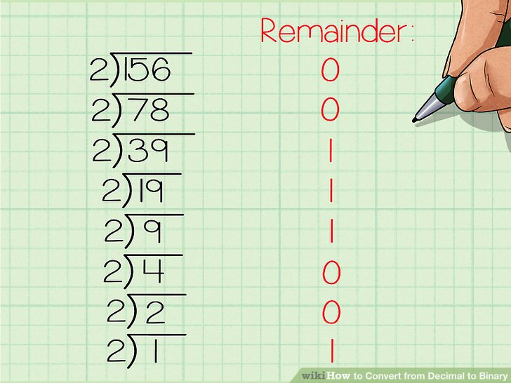

# Implementasi Stack menggunakan List dan Array

Lengkapi kode di bawah ini dengan implementasi dari method yang belum lengkap.

Tidak diperbolehkan untuk mengubah struktur kelas & isi dari fungsi main.

### Spesifikasi tugas:

1. Dibuat dalam 1 file.java
2. Bagian atas file dilengkapi Nama, NIM, dan kelas dalam bentuk komentar
3. Harus dalam keadaan bisa dieksekusi sesuai dengan main yang telah diimplementasikan

```java
//Nama :
//NIM :
//Kelas :


package mystack;

/**
 *
 * @author Riska
 */
public class MyStack {

    
    public static class StackList{
        
        
        public class StackNode{

            private int value;
            private StackNode next;
            
            public StackNode(int newValue){
                this.value = newValue;
                this.next= null;
            }

            //Implementasikan fungsi get
     
            //Implementasikan fungsi set
     
        }
        
        public StackNode head;
        public int size;
        
        public StackList(){
            this.size = 0;
            this.head = null;
        }


        //Implementasi isEmpty()
        
        //Implementasi push, pop, peek, & printStack
        
        public void push(int data){            
        }
        
        public StackNode pop(){
        }
        
        public int peek(){
        }
        
        public void printStack(){
        }
    }
    
    public static class StackArray{
        public int mymax = 5;

        public int[] value;
        public int top;
        public int size;

        public StackArray(){
        //Implementasi konstruktor
        }

        //Implementasi isEmpty() dan isFull()
        
        
        //Implementasi fungsi push, pop, peek, & printStack
        public int push(int data){
        
        }
        
        public int pop (){
        }
        
        public int peek (){
        }
        
        public void printStack(){
        }
        
    }
    
    public static void main(String[] args) {
        
        //Panggil StackList
        StackList sl = new StackList();
        int temp;
        sl.push(5);
        sl.push(6);
        sl.push(7);
        sl.push(8);
        sl.printStack();
        System.out.println("Isi teratas stack list = " + sl.peek());
        temp = sl.pop().getValue();
        System.out.println("Isi teratas stack list = " + sl.peek());
                
        
        //Panggil StackArray
        StackArray sa = new StackArray();
        sa.push(10);
        sa.push(11);
        sa.push(12);
        sa.push(13);
        sa.printStack();
        System.out.println("Isi teratas stack list = " + sa.peek());
        temp = sa.pop();
        System.out.println("Isi teratas stack list = " + sa.peek());
    }
}
```

### Tugas tambahan:

1. Tambahkan method sorting untuk mengurutkan StackArray.
2. Implementasikan stack dalam pengkonversian bilangan desimal ke bilangan binary.

